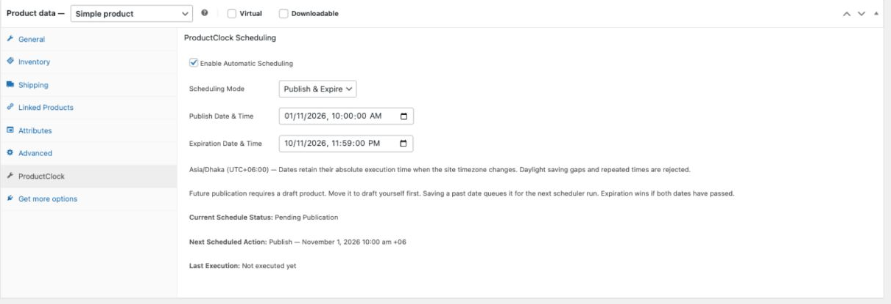
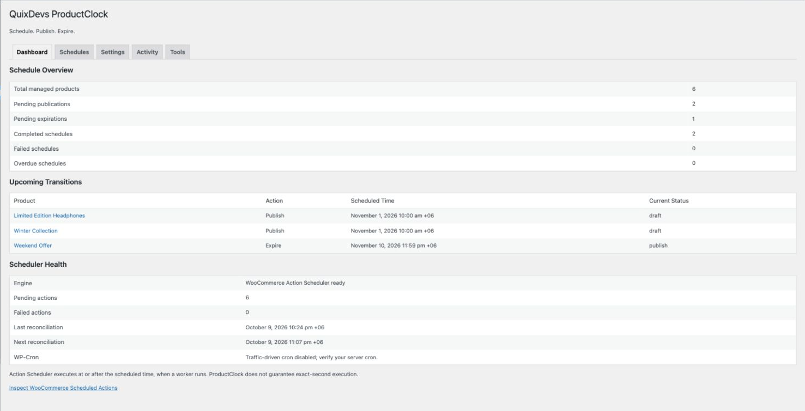
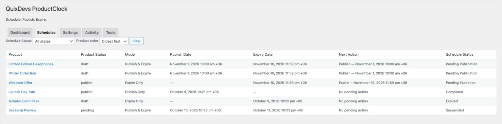
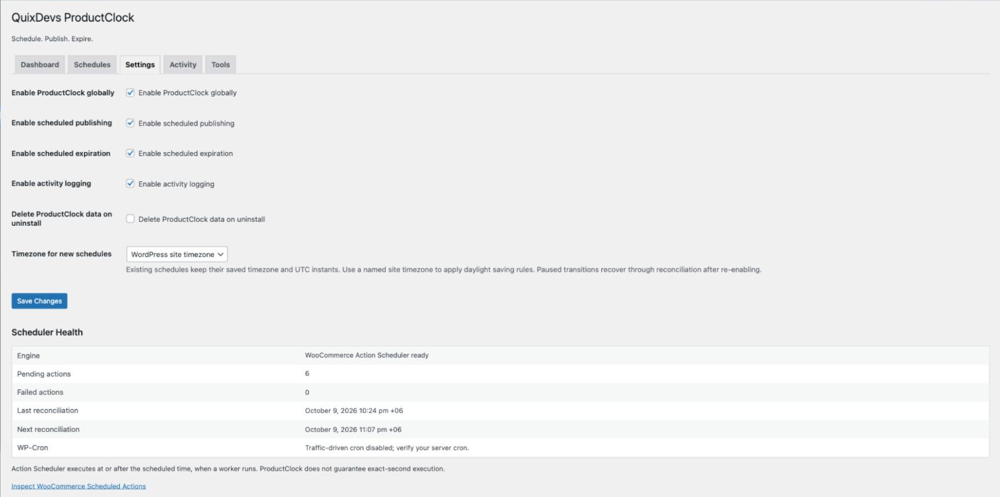
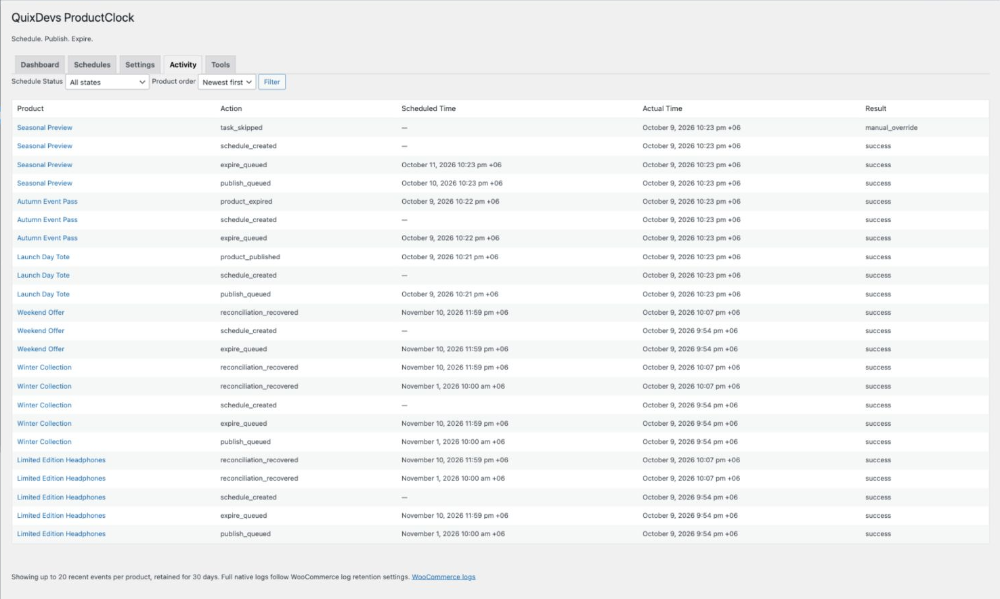

# QuixDevs ProductClock

**Auto Publish & Expire for WooCommerce**  
Schedule. Publish. Expire.

A free, open-source **WooCommerce product scheduler** for product launches, seasonal catalogs and limited availability windows. Automatically publish WooCommerce products on a chosen date, then return them to draft when the window ends—all from the classic product editor.

- Choose **Publish Only**, **Expire Only**, or **Publish & Expire**.
- Keep dates clear with WordPress timezone support and UTC storage.
- Track upcoming actions and activity in a native WooCommerce dashboard.
- Run locally on your store, without an external account or subscription.

**[Install the release ZIP](#installation)** · [Quick start](#quick-start) · [Requirements](#requirements) · [Developer docs](#developer-documentation)

*Set a product’s publication and expiration window in Product Data → ProductClock. Genuine demo-store capture.*

## Why ProductClock?

Launching products manually means being available at launch time. Removing them afterward is another task to remember. ProductClock lets you schedule WooCommerce products ahead of time, coordinate releases and close availability windows automatically.

Expiration means **returning a product to draft**. The product is retained, and its prices, stock, images, categories and attributes stay intact. This controls product visibility; it does not create discounts, manage subscriptions or enforce an order deadline.

## Key features

| Feature | What you can do |
| --- | --- |
| Scheduled publishing | Publish a draft simple product or variable parent at a chosen date and time |
| Automatic expiration | Automatically unpublish products by returning published products to draft |
| Combined schedules | Set one publication and one expiration for the same product |
| Native product controls | Configure schedules in the classic WooCommerce Product Data panel |
| Timezone support | Use the site timezone or UTC for new schedules; keep existing execution instants stable |
| Action Scheduler | Use WooCommerce’s queue, with duplicate protection and stale-task checks |
| Manual override protection | Suspend automation when a product’s status changes manually |
| Scheduling dashboard | Review statistics, upcoming transitions, schedules and engine health |
| Activity and recovery | Inspect recent events, native WooCommerce logs and protected repair tools |
| Local operation | No external SaaS, telemetry, remote API or paid license requirement |

## Screenshots

The scheduling interface is shown above. Expand the other views below; click an image to inspect its original size. All five show the working plugin with synthetic products. [Capture details](docs/screenshots/README.md).

2. Dashboard — statistics, upcoming transitions and scheduler health

*See pending and completed schedules alongside queue health and cron information.*

3. Scheduled products — dates, modes and schedule states

*Filter schedules by state and open a product’s scheduling controls directly.*

4. Settings — global switches, timezone and data retention

*Pause automation, choose the default timezone for new schedules and control uninstall retention.*

5. Activity — successful transitions, recovery and manual overrides

*Compare scheduled and actual execution times. Scheduler diagnostics and recovery controls also appear in Dashboard and Tools.*

## Installation

**WooCommerce must already be installed and active. No Composer or command-line tools are needed on your store.**

When the public release is published, open this repository’s **Releases** section, choose **QuixDevs ProductClock v1.0.0 – WooCommerce Product Scheduler**, and download **`quixdevs-productclock.zip`** under Assets. Use that installable asset rather than GitHub’s automatically generated source archives.

If no release is listed yet, an installable public ZIP has not been published. Maintainers can create it with the local build command below and follow the [publishing checklist](docs/github-publishing-checklist.md).

1. In WordPress Admin, open **Plugins → Add Plugin → Upload Plugin**.
2. Choose `quixdevs-productclock.zip`, select **Install Now**, then **Activate Plugin**.
3. Open **WooCommerce → ProductClock** and check Scheduler Health.

For a local development build, run `python3 tools/build-release.py` from this directory. It creates the installable ZIP beside the source directory, without requiring Composer. This is a maintainer step, not a store-owner installation requirement.

## Quick start

1. Open a simple product or variable parent in the **classic WooCommerce product editor**.
2. Find **Product Data → ProductClock**.
3. Check **Enable Automatic Scheduling**.
4. Select **Publish Only**, **Expire Only**, or **Publish & Expire**.
5. Enter the required dates and review the displayed timezone.
6. Save the product. Keep a future launch product in **draft**; use **Save Draft** for a draft product.
7. Check **Current Schedule Status** and **Next Scheduled Action**, then review the dashboard.

Future publication requires a draft. Expire Only requires a published product. ProductClock never silently drafts an already published product to prepare a future launch.

## Scheduling examples

| Goal | Starting status | Mode and dates |
| --- | --- | --- |
| Launch a new collection | Draft | Publish Only: November 1, 2026 at 10:00 |
| End a seasonal listing | Published | Expire Only: November 10, 2026 at 23:59 |
| Open a limited availability window | Draft | Publish & Expire: November 1 at 10:00 through November 10, 2026 at 23:59 |

Dates use the timezone displayed in the panel. These are illustrative one-time schedules; choose dates appropriate for your store. Expiration must be later than publication. If both dates have already passed, expiration takes precedence and publication is suppressed.

## Dashboard and settings

**WooCommerce → ProductClock** offers five sections:

- **Dashboard:** schedule totals, upcoming transitions and scheduler health.
- **Schedules:** twenty products per page, state filtering, ID ordering and editing links.
- **Settings:** global pause, separate publishing/expiration switches, activity logging, timezone for new schedules and optional uninstall removal.
- **Activity:** up to twenty recent events per product for thirty days, plus a link to WooCommerce logs.
- **Tools:** confirmed due-task execution (up to 25 actions), reconciliation, missing-action repair and server cron guidance.

Site administrators with WooCommerce management permission change global settings and run tools. Shop managers can view the management screens and edit schedules on products they are authorized to manage. [Detailed operation and troubleshooting](docs/store-guide.md).

## How scheduling works

ProductClock creates one-time jobs in **WooCommerce Action Scheduler**. When a worker runs, the plugin checks the current schedule and product status before changing it. Hourly reconciliation repairs missing tasks in bounded batches.

Execution happens **at or after** the scheduled time. Traffic-driven **WP-Cron does not guarantee exact-second execution**. Configure and verify server cron for more dependable processing, and monitor **WooCommerce → Status → Scheduled Actions**, group `quixdevs-productclock`. [Cron setup and recovery](docs/store-guide.md#cron-and-recovery).

## Requirements

| Component | Declared minimum | Locally verified |
| --- | --- | --- |
| WordPress | 6.8 | 6.8.3 |
| WooCommerce | 10.0, installed and active | 10.0.4 |
| PHP | 7.4 | 8.4.13 |
| Database | MySQL/MariaDB with connection-scoped advisory locks and a stable writer connection | MySQL 8.0.46 |

Minimums describe the intended API baseline; they are not proof that every newer or minimum-version combination has been tested.

**Recorded local verification:** 41 integration tests, 78 assertions; PHP syntax and PHPCS passed; runtime-enabled Plugin Check passed; WordPress ZIP upload and activation verified. [Evidence and test matrix](docs/testing.md). GitHub CI execution, broader compatibility and large-store stress tests remain unverified.

## Compatibility and limitations

- **Products:** simple products and variable parent products. Variations are not scheduled independently.
- **Editor:** classic WooCommerce product editor only.
- **Schedule:** one-time publication/expiration; no recurring weekly or monthly schedules.
- **Manual overrides:** manual status changes, trash and restoration suspend automation. Review the product, select **Resume this schedule**, and save to resume. Completed dates are not rearmed by an unchanged save.
- **Protected statuses:** private, pending-review, future and trashed products are never automatically changed.
- **Timezones:** existing schedules retain their captured timezone and UTC instants when site settings change. Invalid dates, daylight saving gaps and repeated times are rejected; there is no per-record timezone reassignment control.
- **Cron:** worker availability determines execution delay. Recovery does not automatically resume suspended/error schedules.
- **Multisite:** manage activation separately per store. Network activation and network-wide cleanup are unsupported; multisite lifecycle has not been verified.

[Architecture and technical limits](docs/architecture.md) · [Verification limits](docs/testing.md#compatibility-claims-and-ci)

## Frequently asked questions

**Does expiration delete a product?**  
No. It returns the product to draft and retains its product data.

**Can I expire a product without a publication date?**  
Yes. Choose Expire Only on a published product.

**Can I change or cancel a schedule?**  
Edit its dates and save to replace pending jobs. Disable scheduling and save to cancel pending work. Enter new dates for a new lifecycle.

**What happens if a task is late or fails?**  
Check Scheduler Health, cron and native Scheduled Actions. Tools can repair missing actions. Review Activity and WooCommerce logs before explicitly resuming a suspended/error schedule.

**What happens on deactivation or uninstall?**  
Deactivation cancels ProductClock’s pending jobs and preserves statuses and schedule data; reactivation reconstructs valid work. An already-started status write may finish. Uninstall retains data by default. Explicitly enabling deletion removes ProductClock data and scheduler records; native WooCommerce logs follow WooCommerce retention.

**Is an external service required?**  
No. ProductClock is a local WordPress product scheduler with no external account, subscription or telemetry.

## Developer documentation

- [Architecture](docs/architecture.md), [data model](docs/data-model.md), [scheduler/state machine/hooks](docs/scheduler.md) and [timezone rules](docs/timezones.md)
- [Tests, recorded verification and compatibility limits](docs/testing.md)
- [Store operation guide](docs/store-guide.md) and [changelog](CHANGELOG.md)
- [GitHub listing](docs/github-listing.md), [release notes](docs/github-release-notes.md) and [publishing checklist](docs/github-publishing-checklist.md)
- [Release checklist](docs/release-checklist.md), [branding sources](docs/branding/README.md) and [WordPress.org asset handoff](wordpress-org-assets/README.md)

## Contributing

Use the repository’s Issues tab for reproducible bugs and feature requests once the repository is public. Include plugin, WordPress, WooCommerce and PHP versions, the product type, expected behavior and reproduction steps. Remove private store data, URLs and credentials from reports.

For code contributions, follow [the testing guide](docs/testing.md), run integration tests and PHPCS, and include a focused regression test for scheduling fixes. Explain metadata or hook changes; keep external requests and site-specific business rules out of the core plugin.

Report suspected security issues privately through GitHub’s **Report a vulnerability** feature if enabled. Otherwise request a private reporting channel without publishing exploit details. The maintainer must confirm the public security contact before release.

## License

Copyright © 2026 QuixDevs. Licensed under [GPL-2.0-or-later](LICENSE).

## 👨‍💻 Developer & Creator

**[Md Abu Hasan (M A Hasan)](https://hasan.online/)**

Full-Stack Software Engineer with **10+ years of experience** building web applications, SaaS platforms, WordPress and WooCommerce plugins, and hybrid mobile applications.

**Technical Expertise:** PHP, Laravel, WordPress, WooCommerce, Ionic Angular, TypeScript, REST APIs, and AI integrations.

- 🌐 **Portfolio & About Me:** [hasan.online](https://hasan.online/)
- 🎓 **Udemy Instructor:** [View Profile](https://www.udemy.com/user/m-a-hasan-2/)
- 🛠️ **Envato Author:** [View Portfolio](https://themeforest.net/user/hasanonline)
- ✍️ **Technical Blog:** [blog.hasan.online](https://blog.hasan.online)

## 🏢 Published & Maintained by

**QuixDevs**

QuixDevs ProductClock is developed and maintained under the **QuixDevs** brand as free, open-source software.

**Copyright © 2026 QuixDevs.**

Licensed under [GPL-2.0-or-later](LICENSE). QuixDevs ProductClock is an independent plugin and is not officially endorsed by WooCommerce.
